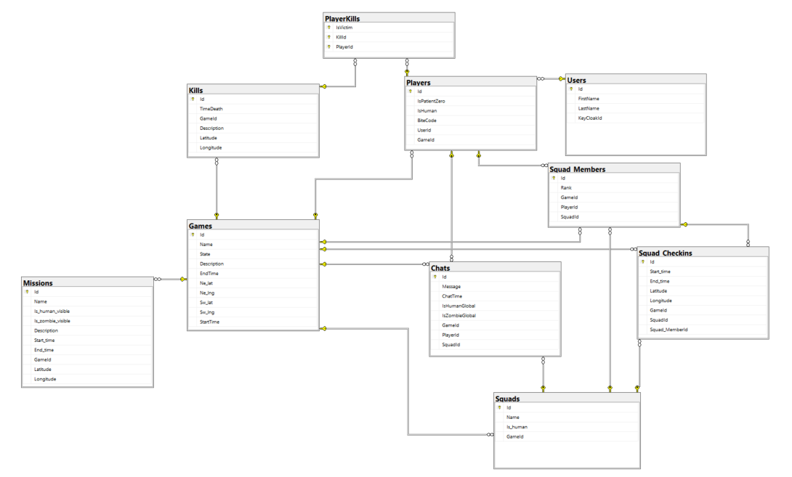

# Description
This is a .Net web-API made that exposes endpoints for the Human vs Zombies game. The API is deployed as a docker image in Azure with the database, and you can explore the api-documented endpoint here https://hvz-experis-acadamy.azurewebsites.net/swagger/index.html or see the document apidoc in the top folder of this project.

## Contributors
- [Eivind Bertelsen](https://gitlab.com/eivindTB)
- [Vebjørn Sundal](https://gitlab.com/vebsun95)
- [Øyvind Reitan](https://gitlab.com/hindrance)
- [Mussa Banjai](https://gitlab.com/MoBanju)
- [Synne Sævik](https://gitlab.com/Synnems)

## Design-choices / Technologies used
 - Database: Microsoft SQL / SQL server
 - ORM: Entity Framework
 - DTO-Mapper: AutoMapper
 - Authentication: KeyCloak  image
 - API deployment: Azure web app
 - API-Documentation: Swagger/Swashbuckle
 - API-Testing: Postman
 - IDE: Visual studio community edition
 - configuration: environmental variables(dotenv.net)
 - JSON-parse: newtonsoft.json
 - Containerization: docker

## ERD Diagram

## Packages used
- AutoMapper.Extensions.Microsoft.DependencyInjection
- dotenv.net
- Microsoft.AspNetCore.Mvc.NewtonsoftJson
- Microsoft.EntityFrameworkCore.Design
- Microsoft.EntityFrameworkCore.SqlServer
- Microsoft.EntityFrameworkCore.Tools
- Newtonsoft.Json
- Swashbuckle.AspNetCore

## Style-guide
.Net https://learn.microsoft.com/en-us/dotnet/csharp/fundamentals/coding-style/coding-conventions
### Casing
 - .Net : 
    - Pascal-Case:
      - Class, record or struct, 
      - Interfaces are prepended I like IWorkerQueue
      - public members of types, such as fields, properties, events, methods, and local functions
    - camel-Case
      - private or internal fields prefix with _, use camelcasing _workerQueue
### Layout
 - .Net: 
    - Indent four-characters, tabs saved as spaces

### Git
https://www.conventionalcommits.org/en/v1.0.0/
 - commit-message:
   - feat: new feature, code added
   - refactor: code change that neither adds feature or fixes bug
   - fix: bugfix usually
   - style: changes that do not affect the meaning of the code
   - docs: documentation
   - chore: no functionallity added, used for adding needed setup like .gitignore
